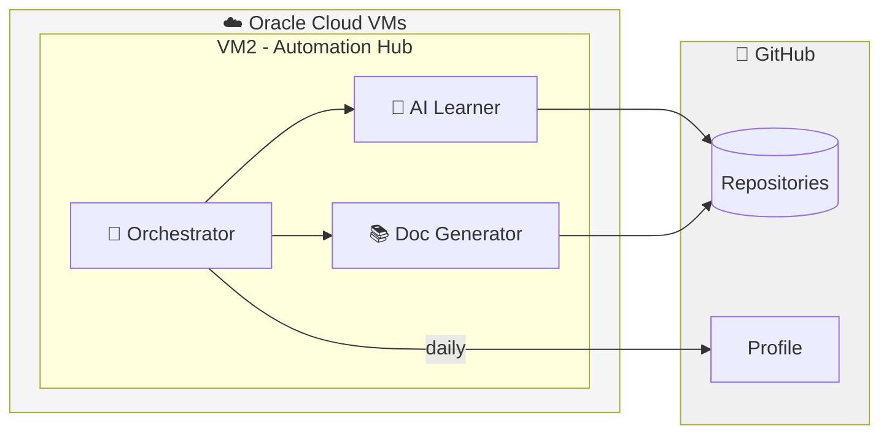

# Hi, I'm Sergei 👋

## 🤖 Autonomous AI Infrastructure

I run a fleet of autonomous AI agents on Oracle Cloud that learn, document, and maintain themselves.

### 🏗️ System Architecture

### 📊 Live Statistics

| Metric | Value |
|--------|-------|
| 🤖 AI Services | 3 running |
| 📁 Projects | 9 analyzed |
| ⚙️ Functions | 179 discovered |
| 🔄 Auto-sync | Every hour |

### 🛠️ Key Projects

| Project | Description | Status |
|---------|-------------|--------|
| [vm-auto-deployer](https://github.com/tikserziku/vm-auto-deployer) | AI automation system | 🟢 Active |
| [mcp-hub](https://github.com/tikserziku/mcp-hub) | MCP Protocol server | 🟢 Active |
| [claude-mailbox](https://github.com/tikserziku/claude-mailbox) | Claude AI integration | 🟢 Active |
| [ai-learning-agent](https://github.com/tikserziku/ai-learning-agent) | Self-learning system | 🔄 Updated |

### 💻 Tech Stack

- **Languages:** Python, JavaScript, TypeScript
- **AI/ML:** Google Gemini, Claude, OpenAI
- **Cloud:** Oracle Cloud (ARM), AWS
- **DevOps:** Systemd, GitHub Actions, MCP

### 📈 Contribution Activity

My AI agents ensure daily activity through automated learning and documentation updates.

---

🤖 This profile is auto-updated by [vm-auto-deployer](https://github.com/tikserziku/vm-auto-deployer)
